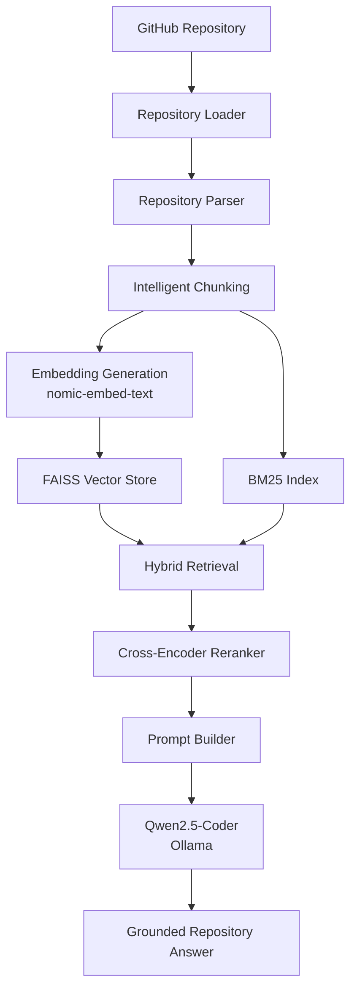
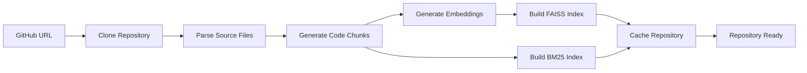
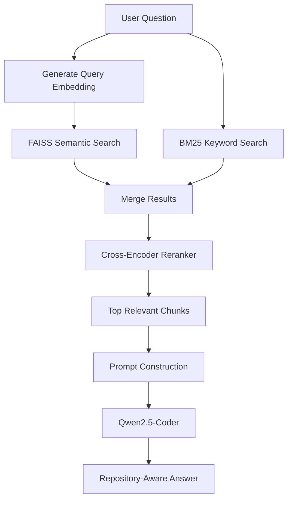
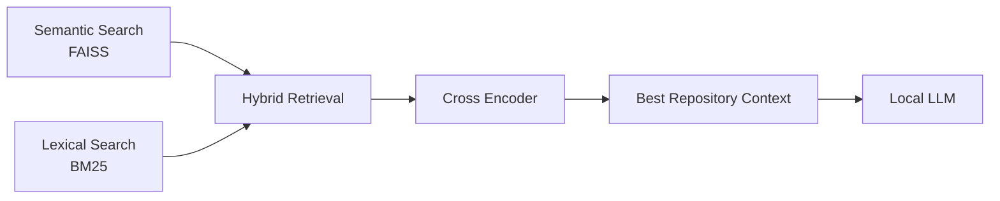

<div align="center">

# 🧠 RepoMind

Hybrid RAG Powered Repository Intelligence Engine

**Analyze, understand, and explore GitHub repositories using Hybrid Retrieval-Augmented Generation (Hybrid RAG) and Local Large Language Models.**

[](https://python.org)
[](https://streamlit.io)
[](https://ollama.com)
[](https://faiss.ai)
[]()
[]()
[](LICENSE)

</div>


# 🚀 Overview

**RepoMind** is a **Repository Intelligence Engine** that helps developers understand unfamiliar GitHub repositories using **Hybrid Retrieval-Augmented Generation (Hybrid RAG)**.

Instead of relying solely on semantic vector search, RepoMind combines **FAISS semantic retrieval**, **BM25 lexical retrieval**, and **Cross-Encoder reranking** to locate the most relevant code before generating grounded explanations with a locally hosted Large Language Model.

Unlike cloud-based coding assistants, **all inference runs locally using Ollama**, ensuring that source code never leaves your machine.

Whether you're onboarding to a new project, exploring an open-source repository, or trying to understand an unfamiliar architecture, RepoMind provides repository-aware answers backed by the indexed codebase.


# ✨ Key Highlights

- 🔍 Analyze any public GitHub repository
- 🧠 Hybrid Retrieval (FAISS + BM25)
- 🎯 Cross-Encoder Reranking for improved retrieval quality
- 🤖 Local LLM inference using Ollama and Qwen2.5-Coder
- 📂 Intelligent repository parsing and chunking
- 📊 Repository Explorer and Inspector
- ⚡ Repository caching for faster re-analysis
- 🔒 Fully local and privacy-first (no external AI APIs)

# 🎯 Why RepoMind?

Modern software repositories are becoming increasingly large, distributed, and difficult to understand. Developers joining an unfamiliar project often spend hours navigating through dozens of files, tracing function calls, and searching for implementation details before they can confidently make changes.

Traditional code search tools provide only partial solutions:

| Approach | Limitation |
|----------|------------|
| **Keyword Search (grep, GitHub Search)** | Finds exact matches but lacks semantic understanding and struggles when naming conventions differ. |
| **Semantic Search Only** | Understands intent but may miss exact identifiers, function names, and configuration values. |
| **Cloud AI Assistants** | Often require uploading proprietary source code to external services, introducing privacy, security, and compliance concerns. |

RepoMind addresses these challenges by combining **Hybrid Retrieval-Augmented Generation (Hybrid RAG)** with **fully local inference** to provide repository-aware answers grounded in the indexed source code.

Instead of relying on a single retrieval strategy, RepoMind combines multiple retrieval techniques, reranks the retrieved context for relevance, and uses a locally hosted Large Language Model to generate accurate, repository-specific explanations.

This approach enables developers to:

- 🚀 Understand unfamiliar repositories faster
- 🔍 Locate important functions, classes, and modules
- 🏗️ Explore project architecture and execution flow
- 📂 Trace feature implementations across multiple files
- 🤖 Ask natural language questions about the codebase
- 🔒 Keep proprietary source code completely local

By combining traditional information retrieval techniques with modern Large Language Models, RepoMind transforms complex repositories into an interactive, searchable knowledge base without compromising privacy.


# ✨ Features

RepoMind combines modern information retrieval techniques with local Large Language Models to provide a repository-aware question answering experience.


## 📂 Repository Analysis

| Feature | Description |
|----------|-------------|
| 🔗 GitHub Repository Cloning | Clone and analyze any public GitHub repository directly from its URL. |
| 📄 Intelligent Code Parsing | Parse Python source files into structured, context-aware chunks for retrieval. |
| 📊 Repository Statistics | Display repository metrics such as file count, code chunks, and indexing information. |
| 🗂 Repository Explorer | Browse indexed repository files and understand project organization. |
| 🔍 Repository Inspector | View repository metadata and analysis summary after indexing. |
| ⚡ Repository Caching | Cache analyzed repositories to eliminate unnecessary re-indexing and improve performance. |


## 🔎 Hybrid Retrieval Engine

RepoMind uses a multi-stage retrieval pipeline instead of relying on a single search technique.

| Component | Purpose |
|-----------|---------|
| 🧠 Semantic Search (FAISS) | Retrieves code based on semantic similarity using vector embeddings. |
| 🔤 Lexical Search (BM25) | Retrieves code using keyword and identifier matching. |
| 🔀 Hybrid Retrieval | Combines semantic and lexical search results to maximize retrieval quality. |
| 🎯 Cross-Encoder Reranking | Reorders retrieved code chunks based on contextual relevance before passing them to the language model. |


## 🤖 Repository Intelligence

After retrieval, RepoMind uses a locally hosted LLM to generate repository-aware answers.

| Capability | Description |
|------------|-------------|
| 🏗 Project Architecture Analysis | Explain the overall organization of a repository. |
| 🔄 Execution Flow Tracing | Trace how functions interact across multiple modules. |
| 📌 Function Discovery | Locate important functions and explain their responsibilities. |
| 📚 Module Understanding | Summarize the purpose of repository modules and packages. |
| 🧩 Class Analysis | Identify important classes and describe their relationships. |
| 💬 Natural Language Question Answering | Ask questions about the repository using plain English. |
| 📍 Grounded Responses | Every answer is generated from retrieved repository context rather than general knowledge. |


## ⚙ AI Pipeline

| Component | Technology |
|-----------|------------|
| Embedding Model | nomic-embed-text (Ollama) |
| Large Language Model | Qwen2.5-Coder |
| Vector Database | FAISS |
| Lexical Retrieval | BM25 |
| Reranker | MiniLM Cross Encoder |
| Runtime | Ollama |


## 🎨 User Experience

RepoMind is designed to provide a smooth repository exploration experience.

| Feature | Description |
|----------|-------------|
| 💬 Interactive Chat Interface | Ask repository-specific questions using a conversational interface. |
| 📋 Expandable Answer History | Review previous conversations without cluttering the interface. |
| 📁 Retrieved File References | Display source files and line ranges used to generate each answer. |
| 🔔 Desktop Notifications | Notify users when repository analysis or answer generation is complete. |
| 📈 Processing Status | Visual indicators for cloning, parsing, indexing, retrieval, and generation stages. |
| 🌙 Modern Streamlit Interface | Clean, responsive interface optimized for repository analysis. |

# 🏗️ System Architecture

RepoMind follows a **Hybrid Retrieval-Augmented Generation (Hybrid RAG)** architecture designed specifically for understanding software repositories.

Instead of relying on a single retrieval strategy, RepoMind combines **semantic retrieval**, **lexical retrieval**, and **cross-encoder reranking** before generating grounded responses using a locally hosted Large Language Model.

---

## High-Level Architecture



---

## Repository Analysis Pipeline

When a repository is analyzed, RepoMind performs the following steps.



### Analysis Workflow

1. Clone the GitHub repository.
2. Parse supported source files.
3. Split source code into meaningful chunks.
4. Generate vector embeddings using **nomic-embed-text**.
5. Build the FAISS vector database.
6. Build the BM25 lexical index.
7. Cache the processed repository for future queries.

---

## Query Processing Pipeline

Every user question follows a multi-stage retrieval pipeline.



---

## Hybrid Retrieval Pipeline

Unlike traditional RAG systems that rely solely on vector search, RepoMind combines multiple retrieval strategies to improve retrieval accuracy.




## Design Principles

RepoMind was designed around several core engineering principles:

### 🎯 Retrieval Before Generation

The language model only receives context retrieved from the indexed repository, reducing hallucinations and encouraging grounded responses.

---

### 🔀 Hybrid Retrieval

Combining semantic and lexical retrieval captures both conceptual similarity and exact identifier matches, improving retrieval quality over either approach alone.

---

### 📈 Multi-Stage Ranking

A Cross-Encoder reranks retrieved code chunks to prioritize the most contextually relevant information before answer generation.

---

### 🔒 Local-First Architecture

All inference runs locally using Ollama, ensuring repository contents remain private and eliminating dependency on external AI services.

---

### ⚡ Efficient Repository Processing

Repositories are parsed, embedded, indexed, and cached after analysis, enabling significantly faster subsequent interactions with the same repository.

---


## Why This Architecture?

This architecture combines the strengths of traditional information retrieval with modern language models.

- **FAISS** provides semantic understanding.
- **BM25** preserves exact keyword and identifier matching.
- **Hybrid Retrieval** balances both approaches.
- **Cross-Encoder Reranking** improves retrieval precision.
- **Local LLM Inference** ensures privacy and eliminates recurring API costs.

The result is a repository intelligence workflow capable of producing accurate, repository-aware responses while keeping all processing on the developer's machine.
# 📂 Project Structure

RepoMind is organized into modular components that separate repository processing, retrieval, language model inference, evaluation, and the user interface.

```text
RepoMind/
│
├── app.py
├── README.md
├── requirements.txt
├── LICENSE
├── .gitignore
│
├── assets/          # Documentation assets
├── core/            # Repository parsing & indexing
├── retrieval/       # Hybrid Retrieval (FAISS + BM25)
├── llm/             # Local LLM integration
├── evaluation/      # Evaluation utilities
└── .streamlit/      # Streamlit configuration
```

## 📦 Directory Overview

| Directory | Purpose |
|-----------|---------|
| **app.py** | Streamlit application entry point and UI orchestration. |
| **core/** | Repository cloning, parsing, chunking, caching, and indexing. |
| **retrieval/** | Implements Hybrid Retrieval using FAISS, BM25, and Cross-Encoder reranking. |
| **llm/** | Handles prompt construction and local LLM inference through Ollama. |
| **evaluation/** | Evaluation scripts and benchmarking utilities. |
| **assets/** | Screenshots and documentation resources. |
| **.streamlit/** | Streamlit configuration and application settings. |
