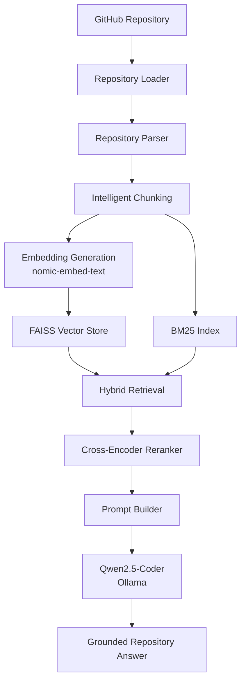
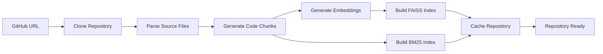
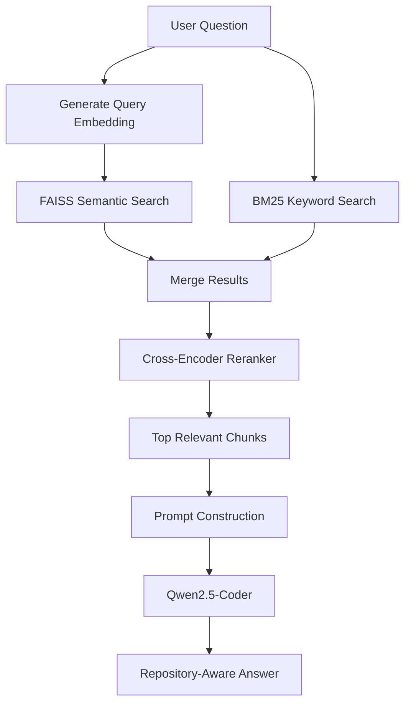
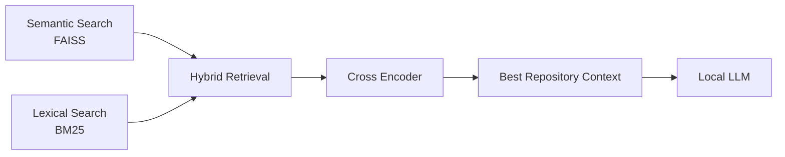

# 🚀 Overview

**RepoMind** is a **Repository Intelligence Engine** that helps developers analyze and understand GitHub repositories using **Hybrid Retrieval-Augmented Generation (Hybrid RAG)**.

By combining **FAISS semantic search**, **BM25 lexical retrieval**, and **Cross-Encoder reranking**, RepoMind retrieves the most relevant repository context before generating grounded explanations with a locally hosted Large Language Model.

Unlike cloud-based coding assistants, **all inference runs locally using Ollama**, ensuring that your source code never leaves your machine.

Whether you're onboarding to a new project, exploring open-source software, or understanding an unfamiliar architecture, RepoMind provides repository-aware answers backed by indexed code.

---

# ✨ Key Highlights

- 🔍 Analyze any public GitHub repository
- 🧠 Hybrid Retrieval (FAISS + BM25)
- 🎯 Cross-Encoder Reranking
- 🤖 Local LLM inference with Ollama & Qwen2.5-Coder
- 📂 Intelligent repository parsing and chunking
- 📊 Repository Explorer & Inspector
- ⚡ Repository caching for faster re-analysis
- 🔒 Fully local and privacy-first

---

# 🎯 Why RepoMind?

Understanding an unfamiliar repository often requires navigating hundreds of files, tracing function calls, and identifying relationships between modules. Traditional tools only solve part of this problem:

| Approach | Limitation |
|----------|------------|
| **Keyword Search (grep, GitHub Search)** | Finds exact matches but lacks semantic understanding. |
| **Semantic Search** | Understands intent but may miss exact identifiers and keywords. |
| **Cloud AI Assistants** | Often require uploading proprietary code to external services. |

RepoMind combines **Hybrid Retrieval-Augmented Generation (Hybrid RAG)** with **fully local inference** to provide repository-aware answers grounded in the indexed source code.

Using **FAISS**, **BM25**, and **Cross-Encoder reranking**, RepoMind retrieves the most relevant context before generating responses with a local LLM, improving answer quality while keeping all processing on your machine.

With RepoMind, developers can:

- 🚀 Understand unfamiliar repositories faster
- 🔍 Locate important functions, classes, and modules
- 🏗️ Explore project architecture and execution flow
- 📂 Trace feature implementations across multiple files
- 🤖 Ask natural language questions about a codebase
- 🔒 Keep proprietary source code completely local

# ✨ Features

RepoMind combines **Hybrid Retrieval-Augmented Generation (Hybrid RAG)** with **local LLM inference** to provide fast, accurate, and privacy-first repository intelligence.

---

## 🚀 Core Capabilities

| Feature | Description |
|---------|-------------|
| 🔗 **Repository Analysis** | Clone and analyze any public GitHub repository. |
| 📄 **Smart Code Parsing** | Parse and chunk source code into searchable units. |
| 🔍 **Hybrid Retrieval** | Combine FAISS semantic search with BM25 lexical search. |
| 🎯 **Cross-Encoder Reranking** | Improve retrieval quality before answer generation. |
| 🤖 **Repository Q&A** | Ask natural language questions about any repository. |
| 📍 **Grounded Responses** | Generate answers using retrieved repository context. |

---

## ⚙️ AI Stack

| Component | Technology |
|-----------|------------|
| **Embedding Model** | nomic-embed-text |
| **Vector Search** | FAISS |
| **Lexical Search** | BM25 |
| **Reranker** | MiniLM Cross Encoder |
| **LLM** | Qwen2.5-Coder |
| **Inference Engine** | Ollama |

---

## 💻 User Experience

- 💬 Interactive repository chat
- 📂 Repository Explorer & Inspector
- 📋 Expandable answer history
- 🔔 Desktop notifications
- ⚡ Repository caching
- 📈 Live processing status

---

## 🔒 Privacy by Design

- ✅ 100% Local Inference
- ✅ No API Keys Required
- ✅ No Cloud AI Services
- ✅ Repository Never Leaves Your Machine
- ✅ Offline After Model Installation

# 🏗️ System Architecture

RepoMind follows a **Hybrid Retrieval-Augmented Generation (Hybrid RAG)** architecture designed specifically for understanding software repositories.

Instead of relying on a single retrieval strategy, RepoMind combines **semantic retrieval**, **lexical retrieval**, and **cross-encoder reranking** before generating grounded responses using a locally hosted Large Language Model.

---

## High-Level Architecture



---

## Repository Analysis Pipeline

When a repository is analyzed, RepoMind performs the following steps.



### Analysis Workflow

1. Clone the GitHub repository.
2. Parse supported source files.
3. Split source code into meaningful chunks.
4. Generate vector embeddings using **nomic-embed-text**.
5. Build the FAISS vector database.
6. Build the BM25 lexical index.
7. Cache the processed repository for future queries.

---

## Query Processing Pipeline

Every user question follows a multi-stage retrieval pipeline.



---

## Hybrid Retrieval Pipeline

Unlike traditional RAG systems that rely solely on vector search, RepoMind combines multiple retrieval strategies to improve retrieval accuracy.



## Why This Architecture?

This architecture combines the strengths of traditional information retrieval with modern language models.

- **FAISS** provides semantic understanding.
- **BM25** preserves exact keyword and identifier matching.
- **Hybrid Retrieval** balances both approaches.
- **Cross-Encoder Reranking** improves retrieval precision.
- **Local LLM Inference** ensures privacy and eliminates recurring API costs.

The result is a repository intelligence workflow capable of producing accurate, repository-aware responses while keeping all processing on the developer's machine.
# 📂 Project Structure

RepoMind is organized into modular components that separate repository processing, retrieval, language model inference, evaluation, and the user interface.

```text
RepoMind/
│
├── app.py
├── README.md
├── requirements.txt
├── LICENSE
├── .gitignore
│
├── assets/          # Documentation assets
├── core/            # Repository parsing & indexing
├── retrieval/       # Hybrid Retrieval (FAISS + BM25)
├── llm/             # Local LLM integration
├── evaluation/      # Evaluation utilities
└── .streamlit/      # Streamlit configuration
```

## 📦 Directory Overview

| Directory | Purpose |
|-----------|---------|
| **app.py** | Streamlit application entry point and UI orchestration. |
| **core/** | Repository cloning, parsing, chunking, caching, and indexing. |
| **retrieval/** | Implements Hybrid Retrieval using FAISS, BM25, and Cross-Encoder reranking. |
| **llm/** | Handles prompt construction and local LLM inference through Ollama. |
| **evaluation/** | Evaluation scripts and benchmarking utilities. |
| **assets/** | Screenshots and documentation resources. |
| **.streamlit/** | Streamlit configuration and application settings. |


# 🚀 Quick Start

```bash
# 1. Clone the repository
git clone https://github.com/sharran-nk/RepoMind.git
cd RepoMind

# 2. Install dependencies
pip install -r requirements.txt

# 3. Pull Ollama models
ollama pull nomic-embed-text
ollama pull qwen2.5-coder

# 4. Start Ollama
ollama serve

# 5. Launch RepoMind
streamlit run streamlit_app.py
```

Once the application starts:

1. Paste a GitHub repository URL.
2. Click **Analyze Repository**.
3. Wait for indexing to complete.
4. Ask natural language questions about the repository.
